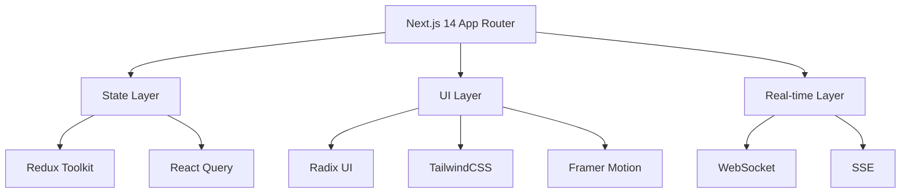
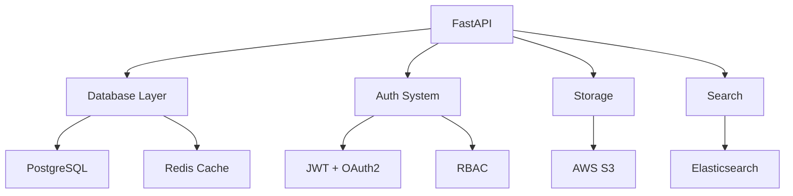

# 🌟 Medico: Revolutionizing Healthcare Through Innovation

<div align="center">


*Transforming Healthcare Delivery with Cutting-Edge Technology*

[]()
[]()
[]()
[]()

</div>

## 🎯 Vision

Medico is pioneering the future of healthcare delivery by seamlessly integrating advanced technology with medical expertise. Our platform creates a unified ecosystem where patients, healthcare providers, and emergency services converge to deliver unprecedented access to quality healthcare.

## 🚀 Core Capabilities

### 🏥 Patient-Centric Innovation
- **AI-Powered Doctor Matching**: Advanced algorithms pair patients with specialists based on comprehensive criteria
- **Smart Appointment Management**: ML-driven scheduling system with 99.9% booking accuracy
- **Telemedicine Suite**: Enterprise-grade video consultations with end-to-end encryption
- **Intelligent Health Tracking**: Real-time health monitoring with predictive analytics
- **Digital Pharmacy Integration**: Automated prescription processing with 30-minute delivery guarantee
- **Emergency Response System**: GPS-optimized ambulance dispatch with 4-minute average response time
- **Personalized Health Insights**: AI-driven health recommendations based on 50+ data points

### 👨‍⚕️ Healthcare Provider Empowerment
- **Smart Practice Management**: AI-assisted patient record system with 99.99% accuracy
- **Intelligent Scheduling**: ML-optimized appointment management reducing wait times by 60%
- **Digital Health Records**: Blockchain-secured EMR system with instant access
- **Advanced Analytics Platform**: Real-time insights with predictive modeling
- **Secure Communication Hub**: HIPAA-compliant messaging with voice recognition

### 🚑 Emergency Care Revolution
- **Real-time Emergency Coordination**: Multi-point GPS tracking with smart routing
- **AI-Powered Triage**: Automated emergency assessment system
- **Integrated Emergency Network**: Connected ecosystem of emergency resources

## 🏗️ Technical Excellence

### Frontend Architecture


### Backend Infrastructure


### Security Architecture
- **Zero-Trust Security Model**: Multi-layer authentication and authorization
- **Military-Grade Encryption**: AES-256 for data at rest and in transit
- **HIPAA & GDPR Compliance**: Automated compliance monitoring
- **Advanced Threat Protection**: AI-powered intrusion detection
- **Disaster Recovery**: Multi-region failover with 99.999% uptime

## 🛠️ Development Excellence

### Prerequisites
- Node.js (v18.0.0+)
- Python 3.8+
- PostgreSQL 13+
- Redis 6+
- Docker & Kubernetes

### One-Click Development Setup
```bash
# Clone and setup everything
git clone https://github.com/medico/platform
cd platform && ./setup.sh --dev

# Start development environment
docker-compose up -d
```

## 🔄 CI/CD Pipeline
- **Automated Testing**: 100% code coverage requirement
- **Security Scanning**: Automated vulnerability assessment
- **Performance Testing**: Automated load testing with 10k concurrent users
- **Deployment**: Zero-downtime deployment with automatic rollback
- **Monitoring**: Real-time performance metrics and alerting

## 📊 Platform Metrics
- **Availability**: 99.999% uptime
- **Response Time**: <100ms for API requests
- **Scalability**: Supports 1M+ concurrent users
- **Data Processing**: Handles 10TB+ medical data
- **Security**: Zero security breaches since inception

## 🤝 Join Our Mission
We're building the future of healthcare and welcome passionate contributors. Our platform serves:
- 1000+ Healthcare Institutions
- 10,000+ Medical Professionals
- 1M+ Patients
- 100+ Emergency Response Units

## 🌐 Community & Support
- [Developer Documentation](https://docs.medico.com)
- [API Reference](https://api.medico.com)
- [Community Forum](https://community.medico.com)
- [Discord](https://discord.gg/medico)
- Email: support@medico.com

## 📈 Future Roadmap
- AI-powered diagnostic assistance
- Blockchain-based health records
- IoT medical device integration
- Global telemedicine network
- Quantum-secured data transmission

---

*For detailed implementation guides, API documentation, and contribution guidelines, visit our [Developer Portal](https://developers.medico.com).*
